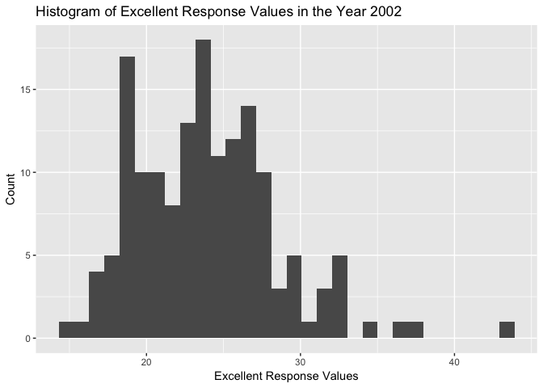
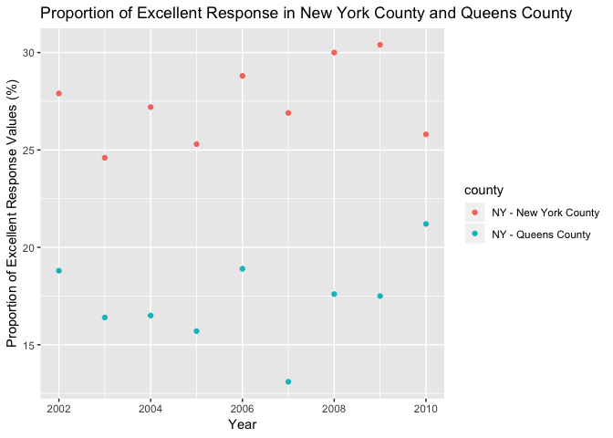

p8105\_hw2\_yw3236
================
Yishan Wang
2018-10-01

Problem 1
=========

### Read and clean the data

-   Retain line, station, name, station latitude / longitude, routes served, entry, vending, entrance type, and ADA compliance.

-   Convert the entry variable from character (`YES` vs `NO`) to a logical variable.

``` r
transit_data = 
  read_csv(file = "./NYC_Transit_Subway_Entrance_And_Exit_Data.csv") %>%
  janitor::clean_names() %>% 
  select(., "line", "station_name", "station_latitude", "station_longitude", "route1":"route11", "entry", "vending", "entrance_type", "ada") %>%
  mutate(., entry = recode(entry, YES = TRUE, NO = FALSE))
```

    ## Parsed with column specification:
    ## cols(
    ##   .default = col_character(),
    ##   `Station Latitude` = col_double(),
    ##   `Station Longitude` = col_double(),
    ##   Route8 = col_integer(),
    ##   Route9 = col_integer(),
    ##   Route10 = col_integer(),
    ##   Route11 = col_integer(),
    ##   ADA = col_logical(),
    ##   `Free Crossover` = col_logical(),
    ##   `Entrance Latitude` = col_double(),
    ##   `Entrance Longitude` = col_double()
    ## )

    ## See spec(...) for full column specifications.

``` r
transit_data
```

    ## # A tibble: 1,868 x 19
    ##    line  station_name station_latitude station_longitu~ route1 route2
    ##    <chr> <chr>                   <dbl>            <dbl> <chr>  <chr> 
    ##  1 4 Av~ 25th St                  40.7            -74.0 R      <NA>  
    ##  2 4 Av~ 25th St                  40.7            -74.0 R      <NA>  
    ##  3 4 Av~ 36th St                  40.7            -74.0 N      R     
    ##  4 4 Av~ 36th St                  40.7            -74.0 N      R     
    ##  5 4 Av~ 36th St                  40.7            -74.0 N      R     
    ##  6 4 Av~ 45th St                  40.6            -74.0 R      <NA>  
    ##  7 4 Av~ 45th St                  40.6            -74.0 R      <NA>  
    ##  8 4 Av~ 45th St                  40.6            -74.0 R      <NA>  
    ##  9 4 Av~ 45th St                  40.6            -74.0 R      <NA>  
    ## 10 4 Av~ 53rd St                  40.6            -74.0 R      <NA>  
    ## # ... with 1,858 more rows, and 13 more variables: route3 <chr>,
    ## #   route4 <chr>, route5 <chr>, route6 <chr>, route7 <chr>, route8 <int>,
    ## #   route9 <int>, route10 <int>, route11 <int>, entry <lgl>,
    ## #   vending <chr>, entrance_type <chr>, ada <lgl>

### A short paragraph about this dataset

The variables that dataset contains are `line`, `station_name`, `station_latitude`, `station_longitude`, `rout1` to `rout11`, `entry`, `vending`, `entrence_type`, `ada`. After reading the dataset to R, I used `janitor::clean_names()` to clean the variable names. Then I used `select` to selecte the variables that I want to keep in the dataset and delete other unwanted variables. Lastly, I used `mutate` and `recode` to convert the `entry` from character variable to logical variable. The dimension of the resulting dataset is 1868 x 19. Yes, the data are not tidy.

### Answering the questons

``` r
nrow(distinct(transit_data, line, station_name))
```

    ## [1] 465

The number of the distinct stations are 465.

``` r
station_ada = 
  distinct(transit_data, line, station_name, .keep_all = TRUE) %>%
  dplyr::filter(., ada == TRUE)

nrow(station_ada)
```

    ## [1] 84

There are 84 stations that are ADA compliant.

``` r
vending_no = transit_data %>%
  dplyr::filter(., vending == 'NO')

prop = nrow(dplyr::filter(vending_no, entry == TRUE)) / nrow(vending_no)
prop
```

    ## [1] 0.3770492

The proportion of station entrances / exists without vending allow entrance is 0.3770492.

``` r
reform_data = transit_data %>%
  gather(., key = route_num, value = route_name, route1:route11) %>%
  dplyr::filter(., route_name == 'A')

dist_station_serve_A = distinct(reform_data, line, station_name, .keep_all = TRUE)
dist_ada_station_serve_A = dplyr::filter(dist_station_serve_A, ada == TRUE)

nrow(dist_station_serve_A)
```

    ## [1] 60

``` r
nrow(dist_ada_station_serve_A)
```

    ## [1] 17

There are 60 distinct stations serve A train, and 17 of them are ADA compliant.

Problem 2
=========

### Read and clean the Mr. Trash Wheel sheet

-   Specify the sheet in the Excel file and to omit columns containing notes.

-   Omit rows that do not include dumpster-specific data.

-   Rounds the number of sports balls to the nearest integer and converts the result to an integer variable.

``` r
trash_data = 
  readxl::read_excel("./HealthyHarborWaterWheelTotals2018-7-28.xlsx", sheet = 1, range = cellranger::cell_cols("A:N")) %>% 
  janitor::clean_names() %>%
  dplyr::filter(., !is.na(dumpster)) %>%
  mutate(sports_balls = round(sports_balls)) %>%
  mutate(sports_balls = as.integer(.$sports_balls))

trash_data
```

    ## # A tibble: 285 x 14
    ##    dumpster month  year date                weight_tons volume_cubic_ya~
    ##       <dbl> <chr> <dbl> <dttm>                    <dbl>            <dbl>
    ##  1        1 May    2014 2014-05-16 00:00:00        4.31               18
    ##  2        2 May    2014 2014-05-16 00:00:00        2.74               13
    ##  3        3 May    2014 2014-05-16 00:00:00        3.45               15
    ##  4        4 May    2014 2014-05-17 00:00:00        3.1                15
    ##  5        5 May    2014 2014-05-17 00:00:00        4.06               18
    ##  6        6 May    2014 2014-05-20 00:00:00        2.71               13
    ##  7        7 May    2014 2014-05-21 00:00:00        1.91                8
    ##  8        8 May    2014 2014-05-28 00:00:00        3.7                16
    ##  9        9 June   2014 2014-06-05 00:00:00        2.52               14
    ## 10       10 June   2014 2014-06-11 00:00:00        3.76               18
    ## # ... with 275 more rows, and 8 more variables: plastic_bottles <dbl>,
    ## #   polystyrene <dbl>, cigarette_butts <dbl>, glass_bottles <dbl>,
    ## #   grocery_bags <dbl>, chip_bags <dbl>, sports_balls <int>,
    ## #   homes_powered <dbl>

### Read and clean precipitation data for 2016 and 2017

-   For each, omit rows without precipitation data and add a variable year.

``` r
prec_17 =
  readxl::read_excel("./HealthyHarborWaterWheelTotals2018-7-28.xlsx", sheet = 4, range = cellranger::cell_cols("A:B")) %>% 
  janitor::clean_names() 

names(prec_17) = as.matrix(prec_17[1, ])
prec_17 = prec_17[-1, ]
prec_17[] = lapply(prec_17, function(x) type.convert(as.character(x))) 

prec_17_new = prec_17 %>%
  janitor::clean_names() %>%
  dplyr::filter(., !is.na(.$total)) %>%
  mutate(., year = '2017') 

prec_17_new
```

    ## # A tibble: 13 x 3
    ##    month total year 
    ##    <int> <dbl> <chr>
    ##  1     1  2.34 2017 
    ##  2     2  1.46 2017 
    ##  3     3  3.57 2017 
    ##  4     4  3.99 2017 
    ##  5     5  5.64 2017 
    ##  6     6  1.4  2017 
    ##  7     7  7.09 2017 
    ##  8     8  4.44 2017 
    ##  9     9  1.95 2017 
    ## 10    10  0    2017 
    ## 11    11  0.11 2017 
    ## 12    12  0.94 2017 
    ## 13    NA 32.9  2017

``` r
prec_16 =
  readxl::read_excel("./HealthyHarborWaterWheelTotals2018-7-28.xlsx", sheet = 5, range = cellranger::cell_cols("A:B")) %>% 
  janitor::clean_names() 

names(prec_16) = as.matrix(prec_16[1, ])
prec_16 = prec_16[-1, ]
prec_16[] = lapply(prec_16, function(x) type.convert(as.character(x))) 

prec_16_new = prec_16 %>%
  janitor::clean_names() %>%
  dplyr::filter(., !is.na(.$total)) %>%
  mutate(., year = '2016') 

prec_16_new
```

    ## # A tibble: 13 x 3
    ##    month total year 
    ##    <int> <dbl> <chr>
    ##  1     1  3.23 2016 
    ##  2     2  5.32 2016 
    ##  3     3  2.24 2016 
    ##  4     4  1.78 2016 
    ##  5     5  5.19 2016 
    ##  6     6  3.2  2016 
    ##  7     7  6.09 2016 
    ##  8     8  3.96 2016 
    ##  9     9  4.53 2016 
    ## 10    10  0.62 2016 
    ## 11    11  1.47 2016 
    ## 12    12  2.32 2016 
    ## 13    NA 39.9  2016

-   Combine datasets and convert month to a character variable.

``` r
prec = left_join(prec_16_new, prec_17_new, by = "month") 
prec
```

    ## # A tibble: 13 x 5
    ##    month total.x year.x total.y year.y
    ##    <int>   <dbl> <chr>    <dbl> <chr> 
    ##  1     1    3.23 2016      2.34 2017  
    ##  2     2    5.32 2016      1.46 2017  
    ##  3     3    2.24 2016      3.57 2017  
    ##  4     4    1.78 2016      3.99 2017  
    ##  5     5    5.19 2016      5.64 2017  
    ##  6     6    3.2  2016      1.4  2017  
    ##  7     7    6.09 2016      7.09 2017  
    ##  8     8    3.96 2016      4.44 2017  
    ##  9     9    4.53 2016      1.95 2017  
    ## 10    10    0.62 2016      0    2017  
    ## 11    11    1.47 2016      0.11 2017  
    ## 12    12    2.32 2016      0.94 2017  
    ## 13    NA   39.9  2016     32.9  2017

``` r
prec_combine = prec %>%
  dplyr::rename(., total_2016 = total.x, total_2017 = total.y) %>%
  select(., -year.x, -year.y) %>%
  mutate(., month.abb[month]) %>%
  select(., -month) %>%
  dplyr::rename(., month = `month.abb[month]`) %>%
  select(., month, total_2016, total_2017)

prec_combine
```

    ## # A tibble: 13 x 3
    ##    month total_2016 total_2017
    ##    <chr>      <dbl>      <dbl>
    ##  1 Jan         3.23       2.34
    ##  2 Feb         5.32       1.46
    ##  3 Mar         2.24       3.57
    ##  4 Apr         1.78       3.99
    ##  5 May         5.19       5.64
    ##  6 Jun         3.2        1.4 
    ##  7 Jul         6.09       7.09
    ##  8 Aug         3.96       4.44
    ##  9 Sep         4.53       1.95
    ## 10 Oct         0.62       0   
    ## 11 Nov         1.47       0.11
    ## 12 Dec         2.32       0.94
    ## 13 <NA>       39.9       32.9

### A paragraph about these data

``` r
nrow(prec_17_new)
```

    ## [1] 13

``` r
nrow(prec_16_new)
```

    ## [1] 13

``` r
trash_data_16 = trash_data %>% 
  dplyr::filter(., year == '2016')
```

There are 13 observations in 2017 precipitation dataset. There are 13 observations in 2016 precipitation dataset. The key variable is `total`, which precipitation total for each month. The total precipitation in 2017 is 32.93. The median number of sports balls in a dumpster in 2016 is 26.

Problem 3
=========

### Load and read the data from the `p8105.datasets` package

``` r
devtools::install_github("p8105/p8105.datasets")
```

    ## Skipping install of 'p8105.datasets' from a github remote, the SHA1 (21f5ad1c) has not changed since last install.
    ##   Use `force = TRUE` to force installation

``` r
library(p8105.datasets)
```

``` r
data(brfss_smart2010)
```

### Format the dataset

-   Format the data to use appropriate variable names.

-   Focus on the “Overall Health” topic.

-   Exclude variables for class, topic, question, sample size, and everything from lower confidence limit to GeoLocation.

-   Structure data so that responses (excellent to poor) are variables taking the value of `Data_value`.

-   Reate a new variable showing the proportion of responses that were “Excellent” or “Very Good”

``` r
formated_brfss_smart2010 = brfss_smart2010 %>%
  janitor::clean_names() %>%
  dplyr::rename(., state = locationabbr, county = locationdesc) %>%
  dplyr::filter(., topic == "Overall Health") %>%
  select(., -class, -topic, -question, -sample_size, -(confidence_limit_low : geo_location)) %>%
  spread(., key = response, value = data_value) %>%
  janitor::clean_names() %>%
  select(., year:county, excellent, very_good, good, fair, poor) %>%
  mutate(., excellent_or_very_good = (excellent + very_good) / (excellent + very_good + good + fair + poor))

formated_brfss_smart2010
```

    ## # A tibble: 2,125 x 9
    ##     year state county excellent very_good  good  fair  poor
    ##    <int> <chr> <chr>      <dbl>     <dbl> <dbl> <dbl> <dbl>
    ##  1  2002 AK    AK - ~      27.9      33.7  23.8   8.6   5.9
    ##  2  2002 AL    AL - ~      18.5      30.9  32.7  12.1   5.9
    ##  3  2002 AR    AR - ~      24.1      29.3  29.9  12.5   4.2
    ##  4  2002 AZ    AZ - ~      21.6      36.6  26.9  10.3   4.6
    ##  5  2002 AZ    AZ - ~      26.6      30.1  31.9   7.5   3.9
    ##  6  2002 CA    CA - ~      22.7      29.8  28.7  14.3   4.5
    ##  7  2002 CO    CO - ~      21.2      31.2  29    14.4   4.2
    ##  8  2002 CO    CO - ~      25.5      35.2  29.3   8     2.1
    ##  9  2002 CO    CO - ~      22.2      27.1  36.6  11.1   3  
    ## 10  2002 CO    CO - ~      23.4      36.6  26.3  11.4   2.4
    ## # ... with 2,115 more rows, and 1 more variable:
    ## #   excellent_or_very_good <dbl>

### Do or answer the questions

``` r
distinct(formated_brfss_smart2010, county)
```

    ## # A tibble: 404 x 1
    ##    county                     
    ##    <chr>                      
    ##  1 AK - Anchorage Municipality
    ##  2 AL - Jefferson County      
    ##  3 AR - Pulaski County        
    ##  4 AZ - Maricopa County       
    ##  5 AZ - Pima County           
    ##  6 CA - Los Angeles County    
    ##  7 CO - Adams County          
    ##  8 CO - Arapahoe County       
    ##  9 CO - Denver County         
    ## 10 CO - Jefferson County      
    ## # ... with 394 more rows

``` r
distinct(formated_brfss_smart2010, state)
```

    ## # A tibble: 51 x 1
    ##    state
    ##    <chr>
    ##  1 AK   
    ##  2 AL   
    ##  3 AR   
    ##  4 AZ   
    ##  5 CA   
    ##  6 CO   
    ##  7 CT   
    ##  8 DC   
    ##  9 DE   
    ## 10 FL   
    ## # ... with 41 more rows

``` r
formated_brfss_smart2010 %>%
  count(state)
```

    ## # A tibble: 51 x 2
    ##    state     n
    ##    <chr> <int>
    ##  1 AK       11
    ##  2 AL       18
    ##  3 AR       21
    ##  4 AZ       32
    ##  5 CA       52
    ##  6 CO       59
    ##  7 CT       47
    ##  8 DC        9
    ##  9 DE       27
    ## 10 FL      122
    ## # ... with 41 more rows

There are 404 unique locations that are included in the dataset. Yes, every state is represented in the data set. The state that is observed most is NJ (146 times).

``` r
formated_brfss_smart2010_2002 = formated_brfss_smart2010 %>%
  dplyr::filter(., year == '2002') 

median(formated_brfss_smart2010$excellent, na.rm = TRUE)
```

    ## [1] 22

The median of "Excellent" is 23.6.

-   Make a histogram of “Excellent” response values in the year 2002.

``` r
ggplot(formated_brfss_smart2010_2002, aes(x = excellent)) + geom_histogram()
```

    ## `stat_bin()` using `bins = 30`. Pick better value with `binwidth`.

    ## Warning: Removed 2 rows containing non-finite values (stat_bin).



-   Make a scatterplot showing the proportion of “Excellent” response values in New York County and Queens County (both in NY State) in each year from 2002 to 2010.

``` r
new_ny_queen = formated_brfss_smart2010 %>%
  dplyr::filter(., county == 'NY - New York County' | county == 'NY - Queens County')

ggplot(new_ny_queen, aes(x = year, y = excellent)) + geom_point(aes(color = county))
```


